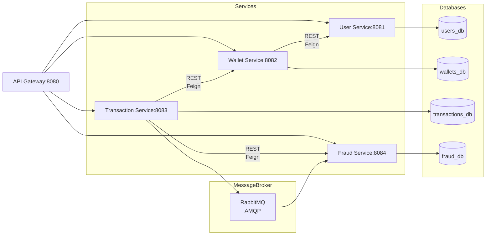

# Fintech Transaction & Wallet Platform - Detailed Architectural Workflow

**Document Version:** 1.0  
**Last Updated:** April 24, 2026  
**Audience:** Architects, Senior Engineers, Tech Leads

---

## TABLE OF CONTENTS

1. [Executive Overview](#executive-overview)
2. [System Architecture](#system-architecture)
3. [Core Service Components](#core-service-components)
4. [Request Lifecycle and Data Flows](#request-lifecycle-and-data-flows)
5. [Communication Patterns](#communication-patterns)
6. [Consistency Guarantees](#consistency-guarantees)
7. [Resilience and Fault Tolerance](#resilience-and-fault-tolerance)
8. [Security Architecture](#security-architecture)
9. [Data Persistence Layer](#data-persistence-layer)
10. [Message-Driven Workflows](#message-driven-workflows)
11. [Deployment Architecture](#deployment-architecture)
12. [Monitoring and Observability](#monitoring-and-observability)
13. [Integration Points](#integration-points)
14. [Error Handling and Recovery](#error-handling-and-recovery)
15. [Development Workflow](#development-workflow)

---

## EXECUTIVE OVERVIEW

### Platform Purpose

The Fintech Transaction & Wallet Platform is a production-grade, microservices-based financial system designed to handle:
- High-volume transaction processing with guaranteed correctness
- Wallet lifecycle management with real-time balance accuracy
- Fraud detection and risk assessment
- Complete audit trails for regulatory compliance
- Scalable, fault-tolerant, and resilient operations

### Key Architectural Principles

| Principle | Implementation |
|-----------|-----------------|
| **Safety First** | Idempotency keys, optimistic locking, strong consistency on critical operations |
| **Resilience** | Circuit breakers, retry logic, graceful degradation, timeout policies |
| **Scalability** | Database-per-service, stateless services, message-driven async processing |
| **Auditability** | Immutable audit trails, correlation IDs, structured logging throughout |
| **Observability** | Distributed tracing, health checks, metrics collection, log aggregation |
| **Security** | JWT validation, inter-service authentication, PII masking, SQL injection prevention |

### Platform Capabilities Matrix

| Capability | Mechanism | SLA |
|------------|-----------|-----|
| Transaction Processing | Synchronous orchestration with async event publishing | < 200ms P95 latency |
| Idempotency | Client-provided keys with server-side deduplication | 24-hour expiry |
| Fraud Detection | Rule-based sync pre-checks + async detailed analysis | Sync decision in < 100ms |
| Wallet Balance Accuracy | Optimistic locking with version control | Strong consistency |
| Audit Trail | Immutable append-only logs via async events | Eventual consistency |
| High Availability | Multi-instance deployment, circuit breakers, failover | 99.9% uptime target |

---

## SYSTEM ARCHITECTURE

### 2.1 Macroscopic View: Layered Architecture

```
┌─────────────────────────────────────────────────────────────────┐
│                    PRESENTATION LAYER                           │
│         (Web Applications, Mobile Apps, Third-party APIs)       │
└──────────────────────────┬──────────────────────────────────────┘
                           │ HTTPS/TLS 1.3
┌──────────────────────────▼──────────────────────────────────────┐
│               API GATEWAY LAYER (:8080)                         │
│    Spring Cloud Gateway | JWT Validation | Rate Limiting       │
│   Request Routing | Correlation ID Propagation | Load Balancing│
└────┬──────────┬──────────┬──────────┬─────────────────────────┘
     │          │          │          │
     ▼          ▼          ▼          ▼
┌────────┐ ┌────────┐ ┌──────────┐ ┌──────────┐
│ User   │ │Wallet  │ │Transaction│ │ Fraud    │
│Service │ │Service │ │Service    │ │Service   │
│        │ │        │ │           │ │          │
└───┬────┘ └──┬─────┘ └──┬────┬───┘ └────┬─────┘
    │         │          │    │          │
    │         │ (REST)   │    │          │
    │         │◄─────────┘    └─────────►│
    │         │                          │
    └─────────┼──────────┬───────────────┘
              │          │
              ▼          ▼
         ┌──────────┐ ┌────────────┐
         │PostgreSQL│ │  RabbitMQ  │
         │ (Per-Svc │ │  (Event    │
         │ Database)│ │  Broker)   │
         └──────────┘ └────────────┘
```

### 2.2 Service Topology



### 2.3 Deployment Environment

```
LOCAL DEVELOPMENT:
  docker-compose up
  ├─ PostgreSQL (single instance, logical databases)
  ├─ RabbitMQ (broker)
  ├─ API Gateway (:8080)
  ├─ User Service (:8081)
  ├─ Wallet Service (:8082)
  ├─ Transaction Service (:8083)
  └─ Fraud Service (:8084)

PRODUCTION (AWS):
  AWS Region
  ├─ Route 53 (DNS)
  ├─ ALB (API Gateway routing)
  ├─ ECS Fargate
  │  ├─ User Service (2 instances, Auto Scaling)
  │  ├─ Wallet Service (3 instances, Auto Scaling)
  │  ├─ Transaction Service (3 instances, Auto Scaling)
  │  └─ Fraud Service (2 instances, Auto Scaling)
  ├─ Amazon RDS PostgreSQL (Multi-AZ)
  ├─ Amazon MQ (RabbitMQ, Multi-AZ)
  ├─ CloudWatch (Monitoring & Logs)
  └─ AWS Secrets Manager (Configuration)
```

---

## CORE SERVICE COMPONENTS

### 3.1 API Gateway Service (Port 8080)

**Technology Stack:** Spring Cloud Gateway, Spring Security, JWT

**Responsibilities:**
- Single entry point for all client requests
- JWT token validation and authentication
- Route requests to appropriate backend services
- Propagate correlation IDs across the system
- Apply rate limiting policies
- Transform headers (add X-User-Id, X-Trace-Id)
- Circuit breaker for downstream services

**Request Processing Flow:**
```
1. Receive HTTP request with Authorization header
2. Extract and validate JWT token
3. Extract claims (user_id, roles, scopes)
4. Generate/propagate Correlation-ID
5. Add X-User-Id and X-Trace-Id headers
6. Check rate limits (IP-based, user-based)
7. Route to appropriate service based on path
8. If downstream unavailable → Return 503 with graceful message
9. Return response to client
```

**Configuration:**
- JWT secret: Loaded from environment variables
- Route configuration in `application.yml`
- Circuit breaker thresholds: Configurable per service
- Timeout: 30 seconds default for all routes

---

### 3.2 User Service (Port 8081)

**Technology Stack:** Spring Boot 3, Spring Data JPA, Hibernate, PostgreSQL

**Responsibilities:**
- User registration and authentication metadata management
- User profile CRUD operations
- KYC (Know Your Customer) status tracking
- Account lifecycle management (active, inactive, suspended)
- Publishing user domain events

**Data Model:**
```
users table:
  - id (UUID, Primary Key)
  - email (VARCHAR, Unique, Indexed)
  - phone_number (VARCHAR)
  - full_name (VARCHAR)
  - kyc_status (ENUM: PENDING, VERIFIED, REJECTED)
  - account_status (ENUM: ACTIVE, INACTIVE, SUSPENDED)
  - created_at (TIMESTAMP)
  - updated_at (TIMESTAMP)
  - version (BIGINT, for optimistic locking)
```

**Key APIs:**
```
POST /users/register
  - Create new user
  - Request: { email, phone_number, full_name }
  - Response: { userId, email, kyc_status }
  - Idempotency: Key-based deduplication

GET /users/{userId}
  - Retrieve user details
  - Authorization: JWT required

PUT /users/{userId}
  - Update user profile
  - Optimistic locking via version field

DELETE /users/{userId}
  - Soft delete (mark as INACTIVE)
```

**Event Publications:**
- `UserCreated`: When new user registered
- `UserDeactivated`: When user account deactivated
- Events published to RabbitMQ `user.events` exchange

---

### 3.3 Wallet Service (Port 8082)

**Technology Stack:** Spring Boot 3, Spring Data JPA, Hibernate, PostgreSQL, Resilience4j

**Responsibilities:**
- Wallet lifecycle management (create, activate, deactivate)
- Real-time balance tracking with strong consistency
- Credit and debit operations with atomic transactions
- Audit trail for all balance mutations
- Transaction history queries

**Data Models:**
```
wallets table:
  - id (UUID, Primary Key)
  - user_id (UUID, Foreign Key → users)
  - balance (NUMERIC(19,4), with precision)
  - currency (VARCHAR, e.g., "USD", "EUR")
  - status (ENUM: ACTIVE, FROZEN, CLOSED)
  - created_at (TIMESTAMP)
  - updated_at (TIMESTAMP)
  - version (BIGINT, CRITICAL for optimistic locking)

wallet_audit_log table:
  - id (BIGINT, Auto-increment, Primary Key)
  - wallet_id (UUID, Foreign Key)
  - transaction_id (UUID, Foreign Key)
  - operation_type (ENUM: CREDIT, DEBIT)
  - amount (NUMERIC(19,4))
  - balance_before (NUMERIC(19,4))
  - balance_after (NUMERIC(19,4))
  - reason (VARCHAR, e.g., "Transaction XYZ")
  - created_at (TIMESTAMP)
```

**Critical Balance Update Algorithm:**
```
updateBalance(walletId, amount, operation, maxRetries=3):
  for attempt = 1 to maxRetries:
    try:
      wallet = SELECT * FROM wallets WHERE id=walletId FOR UPDATE
      if operation == DEBIT and wallet.balance < amount:
        throw InsufficientFundsException()
      newBalance = wallet.balance + (operation == CREDIT ? amount : -amount)
      UPDATE wallets SET balance=newBalance, version=version+1 WHERE id=walletId AND version=wallet.version
      INSERT INTO wallet_audit_log (...)
      return SUCCESS
    catch OptimisticLockException:
      if attempt < maxRetries:
        wait(exponentialBackoff(attempt))
        continue
      else:
        throw ConcurrencyException()
```

**Key APIs:**
```
POST /wallets
  - Create wallet for user
  - Request: { userId, currency }
  - Response: { walletId, balance, status }

GET /wallets/{walletId}
  - Retrieve wallet with current balance
  - Highly cacheable (2-minute TTL)

POST /wallets/{walletId}/credit
  - Add funds (from transaction processing)
  - Request: { amount, transactionId }
  - Response: { newBalance, operationId }

POST /wallets/{walletId}/debit
  - Withdraw funds (from transaction processing)
  - Request: { amount, transactionId }
  - Response: { newBalance, operationId }
  - Error: 422 if insufficient funds

GET /wallets/{walletId}/audit-log
  - Retrieve balance mutation history
  - Supports pagination and filtering
```

**Consistency Guarantees:**
- Optimistic locking ensures concurrent updates don't lose data
- Version column incremented on every successful update
- Conflicting updates trigger automatic retry with exponential backoff
- Max 3 retries before failing the request

---

### 3.4 Transaction Service (Port 8083)

**Technology Stack:** Spring Boot 3, Spring Data JPA, Resilience4j, OpenFeign, Saga Pattern

**Responsibilities:**
- Transaction orchestration (the main coordinator)
- Idempotency key management and deduplication
- Synchronous fraud pre-screening
- Synchronous wallet balance mutations
- Async event publishing for post-transaction analysis
- Transaction state machine management

**Data Models:**
```
transactions table:
  - id (UUID, Primary Key)
  - source_wallet_id (UUID, Foreign Key)
  - destination_wallet_id (UUID, Foreign Key)
  - amount (NUMERIC(19,4))
  - status (ENUM: INITIATED, FRAUD_CHECK_PENDING, DEBITED, CREDITED, COMPLETED, FAILED, ROLLED_BACK)
  - fraud_decision (ENUM: PENDING, APPROVED, REVIEW, REJECTED)
  - failure_reason (VARCHAR, nullable)
  - created_at (TIMESTAMP)
  - updated_at (TIMESTAMP)
  - initiated_by_user_id (UUID, Foreign Key)

idempotency_keys table:
  - id (UUID, Primary Key)
  - idempotency_key (VARCHAR, Unique, Indexed)
  - request_hash (VARCHAR, SHA-256 of request body)
  - response_body (JSONB, cached response)
  - transaction_id (UUID, nullable, Foreign Key)
  - status (ENUM: PENDING, COMPLETED, FAILED)
  - expires_at (TIMESTAMP, 24 hours from creation)
  - created_at (TIMESTAMP)
```

**Transaction Processing State Machine:**
```
[INITIATED]
    │
    ├─ Idempotency check: If key exists with COMPLETED status → Return cached response
    │  └─ Update expires_at to now() + 24 hours
    │
    ▼
[FRAUD_CHECK_PENDING]
    │
    ├─ Call Fraud Service synchronously
    ├─ Fraud decision options:
    │  ├─ APPROVED → Continue to debit
    │  ├─ REVIEW → Continue with flag (manual review required later)
    │  └─ REJECTED → Jump to [FAILED], save reason
    │
    ▼
[DEBITED]
    │
    ├─ Call Wallet Service to debit source wallet
    ├─ On success: Update transaction status
    ├─ On InsufficientFundsException:
    │  ├─ Update status to [FAILED]
    │  └─ Skip credit operation
    ├─ On WalletServiceException (network/timeout):
    │  ├─ Trigger compensating transaction (credit source wallet)
    │  └─ Status to [ROLLED_BACK]
    │
    ▼
[CREDITED]
    │
    ├─ Call Wallet Service to credit destination wallet
    ├─ On success: Update transaction status
    ├─ On Exception:
    │  ├─ Trigger compensating transaction (credit source wallet back)
    │  └─ Status to [ROLLED_BACK]
    │
    ▼
[COMPLETED] or [FAILED] or [ROLLED_BACK]
    │
    ├─ Update idempotency_keys.status to COMPLETED
    ├─ Cache response in idempotency_keys.response_body
    ├─ Publish TransactionCompleted or TransactionFailed event
    │  ├─ Event includes: transactionId, status, fraudDecision, amount, timestamp
    │  └─ Subscribers: Fraud Service (async analysis), Audit Consumer
    │
    └─ Return response to client
```

**Key APIs:**
```
POST /transactions/pay
  - Initiate payment
  - Request: {
      idempotency_key: UUID,
      source_wallet_id: UUID,
      destination_wallet_id: UUID,
      amount: decimal,
      reference: string (optional, for display)
    }
  - Response: {
      transaction_id: UUID,
      status: string,
      fraud_decision: string,
      amount: decimal,
      timestamp: ISO-8601
    }
  - Errors:
    - 400: Invalid request format
    - 409: Duplicate idempotency key with different payload (422 Unprocessable Entity)
    - 422: Fraud rejected, insufficient funds
    - 503: Wallet service unavailable (circuit breaker open)

GET /transactions/{transactionId}
  - Retrieve transaction details and status
  - Response includes full audit trail

GET /transactions
  - List transactions with filtering and pagination
  - Query params: status, fraud_decision, date_range, limit, offset
```

**Resilience Mechanisms:**
```
Feign client configurations:
  - ConnectTimeout: 5 seconds
  - ReadTimeout: 10 seconds
  - Circuit Breaker: Threshold 50%, wait 30 seconds before retry

Retry Policy:
  - Max 3 attempts for transient failures (timeout, 5xx)
  - Exponential backoff: 100ms, 200ms, 400ms
  - No retry for 4xx (client errors) except 408 (timeout)

Timeout Policy:
  - Fraud check: Max 100ms, fail-open (APPROVED if timeout)
  - Wallet operations: Max 5 seconds, fail-closed (transaction ROLLED_BACK)
```

---

### 3.5 Fraud Service (Port 8084)

**Technology Stack:** Spring Boot 3, Spring Data JPA, RabbitMQ Consumer, Rule Engine

**Responsibilities:**
- Real-time fraud pre-screening for transaction approval
- Post-transaction detailed fraud analysis
- Rule-based risk scoring
- Fraud alert generation
- Historical fraud pattern analysis

**Data Models:**
```
fraud_checks table:
  - id (UUID, Primary Key)
  - transaction_id (UUID, Foreign Key → transactions)
  - check_timestamp (TIMESTAMP)
  - risk_score (NUMERIC(3,2), 0.00 to 1.00)
  - decision (ENUM: APPROVED, REVIEW, REJECTED)
  - rules_triggered (JSONB, array of rule names and scores)
  - reason (VARCHAR, human-readable)

fraud_rules table:
  - id (BIGINT, Primary Key)
  - rule_name (VARCHAR, e.g., "HIGH_AMOUNT_THRESHOLD")
  - rule_type (ENUM: AMOUNT_THRESHOLD, VELOCITY_CHECK, GEO_VELOCITY, PATTERN_MATCH)
  - condition (JSONB, rule configuration)
  - risk_score_increment (NUMERIC(3,2))
  - enabled (BOOLEAN)
  - created_at (TIMESTAMP)
  - updated_at (TIMESTAMP)

fraud_alerts table:
  - id (UUID, Primary Key)
  - user_id (UUID, Foreign Key)
  - transaction_id (UUID, Foreign Key)
  - alert_level (ENUM: LOW, MEDIUM, HIGH, CRITICAL)
  - description (VARCHAR)
  - status (ENUM: OPEN, UNDER_REVIEW, RESOLVED, FALSE_POSITIVE)
  - created_at (TIMESTAMP)
  - updated_at (TIMESTAMP)
```

**Fraud Rules Engine:**

```
Real-time Pre-Check (Sync, < 100ms):
  1. Amount Threshold Check
     - If amount > configured_threshold: add 0.3 to risk_score
     
  2. Velocity Check (Last 1 hour)
     - Count: SELECT COUNT(*) FROM transactions 
             WHERE user_id = ? AND created_at > NOW() - 1 hour
     - If count > threshold: add 0.4 to risk_score
     
  3. Geographic Velocity (Last 24 hours)
     - If last transaction origin != current origin:
       - If time_since_last_txn < min_travel_time: add 0.5 to risk_score
     
  4. Pattern Matching
     - If amount matches known fraud patterns: add 0.2 to risk_score

Decision Logic:
  if risk_score >= 0.8: return REJECTED (block transaction)
  if risk_score >= 0.5: return REVIEW (proceed with flag)
  else: return APPROVED (proceed)

Post-Transaction Analysis (Async):
  - Consume TransactionCompleted event
  - Run detailed fraud rules (may take 1-5 seconds)
  - If fraud_score > 0.6: Generate fraud alert
  - Store fraud_check record
  - Publish FraudAlertRaised event if necessary
```

**Key APIs:**
```
POST /fraud/check
  - Pre-transaction fraud screening (called by Transaction Service)
  - Request: {
      user_id: UUID,
      amount: decimal,
      source_wallet_id: UUID,
      destination_wallet_id: UUID,
      transaction_timestamp: ISO-8601,
      user_ip: string (optional),
      user_geolocation: { latitude, longitude } (optional)
    }
  - Response: {
      decision: string (APPROVED | REVIEW | REJECTED),
      risk_score: decimal,
      rules_triggered: [string],
      reason: string
    }
  - SLA: < 100ms P95

GET /fraud/alerts
  - List fraud alerts with filtering
  - Query params: user_id, status, severity, date_range

PUT /fraud/alerts/{alertId}
  - Update fraud alert status (for manual review)
  - Request: { status: RESOLVED, resolution_reason: string }

GET /fraud/rules
  - Retrieve active fraud rules for administration
```

**RabbitMQ Consumer Implementation:**
```
Queue: fraud-analysis-queue
Binding: transactions.* → fraud-analysis-queue

Message Handler (onTransactionCompleted):
  1. Parse event: { transactionId, amount, userId, timestamp, fraudDecision }
  2. Query transaction details from Transaction Service
  3. Run post-transaction fraud analysis (detailed rules)
  4. Store fraud_check record
  5. If risk_score > 0.6 and decision != REJECTED:
     - Create fraud_alerts entry
     - Publish FraudAlertRaised event
  6. Update fraud checks table
  7. Acknowledge message
```

---

## REQUEST LIFECYCLE AND DATA FLOWS

### 4.1 Complete Transaction Processing Flow

```
USER CLIENT
│
├─ Generate UUID as Idempotency-Key
└─ POST /transactions/pay
   Headers: Authorization: Bearer {JWT}, Idempotency-Key: {UUID}
   Body: { source_wallet, destination_wallet, amount }
   │
   ▼
API GATEWAY (:8080)
│
├─ Validate JWT token → Extract user_id from claims
├─ Generate/Propagate Correlation-ID (e.g., "corr-123-abc")
├─ Apply rate limiting check (e.g., 1000 req/minute per user)
├─ Add headers: X-User-Id, X-Trace-Id, X-Correlation-ID
└─ Route to Transaction Service (http://transaction-service:8083/transactions/pay)
   │
   ▼
TRANSACTION SERVICE (:8083) - Receives Request
│
├─ Step 1: Idempotency Key Check (Latency: ~5ms)
│  ├─ Query: SELECT * FROM idempotency_keys WHERE idempotency_key = ?
│  ├─ If found:
│  │  ├─ If status == COMPLETED: Return cached response_body (FAST PATH)
│  │  ├─ If status == PENDING: Wait (polling) or return 409 Conflict
│  │  └─ If status == FAILED: Return error response from cache
│  └─ If not found: Continue to Step 2
│
├─ Step 2: Insert Pending Idempotency Record (Latency: ~3ms)
│  ├─ INSERT INTO idempotency_keys (idempotency_key, status=PENDING, ...)
│  └─ Purpose: Prevent race conditions if same request arrives twice
│
├─ Step 3: Validate Request (Latency: ~2ms)
│  ├─ source_wallet != destination_wallet
│  ├─ amount > 0
│  ├─ Both wallets belong to same currency
│  └─ If validation fails → Update idempotency status to FAILED, return 400
│
├─ Step 4: Synchronous Fraud Pre-Check (Latency: ~80ms, max 100ms timeout)
│  ├─ Call Fraud Service via Feign client
│  ├─ Request: POST http://fraud-service:8084/fraud/check
│  ├─ If timeout: Fail-open (treat as APPROVED)
│  ├─ If REJECTED: Save transaction as FAILED, return 422 to client
│  └─ If APPROVED or REVIEW: Continue to Step 5
│
├─ Step 5: Synchronous Wallet Debit (Latency: ~30ms)
│  ├─ Call Wallet Service via Feign client
│  ├─ Request: POST http://wallet-service:8082/wallets/{sourceId}/debit
│  ├─ Wallet Service internally:
│  │  ├─ Acquire row lock on wallets table
│  │  ├─ Check version for optimistic locking
│  │  ├─ Validate balance >= amount
│  │  ├─ Decrement balance, increment version
│  │  ├─ INSERT audit log entry
│  │  └─ Commit transaction (atomic)
│  ├─ If InsufficientFundsException: Save transaction as FAILED, return 422
│  ├─ If timeout/circuit breaker open:
│  │  ├─ Compensate: Credit source wallet back
│  │  ├─ Save transaction as ROLLED_BACK
│  │  └─ Return 503 Service Unavailable
│  └─ On success: Update transaction status to DEBITED
│
├─ Step 6: Synchronous Wallet Credit (Latency: ~30ms)
│  ├─ Call Wallet Service via Feign client
│  ├─ Request: POST http://wallet-service:8082/wallets/{destId}/credit
│  ├─ Wallet Service performs similar operations
│  ├─ If timeout/circuit breaker open:
│  │  ├─ Compensate: Debit destination wallet, credit source wallet back
│  │  ├─ Save transaction as ROLLED_BACK
│  │  └─ Return 503 Service Unavailable
│  └─ On success: Update transaction status to CREDITED
│
├─ Step 7: Update Transaction as COMPLETED (Latency: ~5ms)
│  ├─ INSERT INTO transactions (status=COMPLETED, fraud_decision, ...)
│  └─ Update idempotency_keys status to COMPLETED, cache response_body
│
├─ Step 8: Asynchronous Event Publication (Latency: ~20ms, non-blocking)
│  ├─ Publish TransactionCompleted event to RabbitMQ
│  │  ├─ Exchange: transactions.events
│  │  ├─ Routing Key: transactions.completed
│  │  └─ Payload: { transactionId, sourceWallet, destWallet, amount, status, fraud_decision, timestamp }
│  │
│  └─ Event subscribers (non-blocking):
│     ├─ Fraud Service: Async detailed fraud analysis
│     └─ Audit Consumer: Immutable audit trail
│
└─ Total Sync Latency: ~155ms (Step 1-7)
   Return HTTP 200 OK with transaction details
   │
   ▼
USER CLIENT
└─ Receives response with transaction_id and status=COMPLETED
   Can poll GET /transactions/{transactionId} for detailed status
```

### 4.2 Wallet Balance Update Flow (Deep Dive)

```
Transaction Service Calls:
POST /wallets/{walletId}/debit
Body: { amount: 100.00, transactionId: "txn-123" }
│
▼
WALLET SERVICE Handler
│
├─ Acquire database connection from pool
├─ BEGIN TRANSACTION (Isolation Level: READ_COMMITTED)
│
├─ Step 1: Lock and Load Wallet
│  ├─ SQL: SELECT * FROM wallets WHERE id = ? FOR UPDATE
│  │  └─ FOR UPDATE acquires exclusive row lock (prevents concurrent updates)
│  ├─ Load current state:
│  │  ├─ balance = 500.00
│  │  ├─ version = 3
│  │  └─ status = ACTIVE
│  │
│  ├─ Alternative: Optimistic Lock (if using @Version)
│  │  ├─ SELECT * FROM wallets WHERE id = ?
│  │  └─ Check version before update
│
├─ Step 2: Validation
│  ├─ if amount <= 0: throw InvalidAmountException()
│  ├─ if balance < amount: throw InsufficientFundsException()
│  └─ if status != ACTIVE: throw WalletFrozenException()
│
├─ Step 3: Calculate New Balance
│  ├─ newBalance = balance - amount
│  └─ Result: 400.00
│
├─ Step 4: Persist Balance Update (with Optimistic Lock)
│  ├─ SQL: UPDATE wallets 
│          SET balance = ?, 
│              version = version + 1,
│              updated_at = NOW()
│          WHERE id = ? AND version = ?
│  │
│  ├─ Bind parameters:
│  │  ├─ balance = 400.00
│  │  ├─ id = {walletId}
│  │  └─ version = 3 (current version)
│  │
│  ├─ If optimistic lock fails (version mismatch):
│  │  ├─ ROLLBACK transaction
│  │  ├─ Increment retry counter
│  │  ├─ if retries < MAX_RETRIES (3):
│  │  │  ├─ Wait exponentialBackoff(retries) → e.g., 100ms
│  │  │  └─ Retry entire operation from Step 1
│  │  └─ else:
│  │     └─ throw ConcurrentUpdateException()
│  │
│  └─ On success: version incremented to 4
│
├─ Step 5: Insert Audit Log Entry
│  ├─ SQL: INSERT INTO wallet_audit_log (
│            wallet_id, transaction_id, operation_type, 
│            amount, balance_before, balance_after, 
│            reason, created_at
│          )
│          VALUES (?, ?, 'DEBIT', ?, ?, ?, ?, NOW())
│  │
│  ├─ Bind parameters:
│  │  ├─ wallet_id = {walletId}
│  │  ├─ transaction_id = "txn-123"
│  │  ├─ amount = 100.00
│  │  ├─ balance_before = 500.00
│  │  ├─ balance_after = 400.00
│  │  └─ reason = "Transaction XYZ"
│  │
│  └─ Audit record created with monotonically increasing ID
│
├─ Step 6: Commit Transaction
│  ├─ COMMIT (all changes become durable and visible)
│  ├─ Row lock released
│  └─ Connection returned to pool
│
└─ Response to Transaction Service
   ├─ HTTP 200 OK
   ├─ Body: {
        walletId: {walletId},
        newBalance: 400.00,
        operation: "DEBIT",
        timestamp: ISO-8601
      }

CONCURRENT REQUEST HANDLING (RCC = Read-Committed Consistency):
Timeline of concurrent debit attempts:
  T1: Request A arrives (amount=100)
  T2: Request B arrives (amount=50)
  T3: Request A acquires lock, reads wallet (balance=500, version=3)
  T4: Request B queues for lock (blocked)
  T5: Request A checks balance (500 >= 100) ✓
  T6: Request A updates balance to 400, increments version to 4
  T7: Request A commits, releases lock
  T8: Request B acquires lock, reads wallet (balance=400, version=4)
  T9: Request B checks balance (400 >= 50) ✓
  T10: Request B updates balance to 350, increments version to 5
  T11: Request B commits

Final balance: 350 (both operations applied correctly, no lost updates)
```

---

## COMMUNICATION PATTERNS

### 5.1 Synchronous Communication (REST via Feign)

**Pattern:** Request-Response, Service-to-Service

**Technologies:**
- OpenFeign for declarative HTTP clients
- Spring Cloud LoadBalancer for client-side load balancing
- Resilience4j for circuit breaking and retry

**Transaction Service → Wallet Service Example:**
```java
@FeignClient(name = "wallet-service", url = "${wallet-service.url:http://wallet-service:8082}")
public interface WalletServiceClient {
    
    @PostMapping("/wallets/{walletId}/debit")
    @CircuitBreaker(name = "walletService", fallback = WalletServiceFallback.class)
    @Retry(name = "walletService")
    @Timeout(duration = "5s")
    WalletOperationResponse debit(
        @PathVariable UUID walletId,
        @RequestBody DebitRequest request,
        @RequestHeader("X-Correlation-ID") String correlationId
    );
}
```

**Headers Propagation:**
```
Original Request (Client → API Gateway):
  Authorization: Bearer {JWT}
  Idempotency-Key: {UUID}

Modified by API Gateway:
  X-User-Id: {userId from JWT}
  X-Trace-Id: {traceId}
  X-Correlation-ID: {generated UUID or propagated}

Service-to-Service Calls (Transaction → Wallet):
  Automatically inherited from parent request context
  X-Correlation-ID: {same as original}
  X-User-Id: {same as original}
  X-Service-Auth: {internal service token}
```

**Circuit Breaker Configuration:**
```yaml
resilience4j:
  circuitbreaker:
    configs:
      default:
        sliding-window-size: 10
        minimum-number-of-calls: 5
        failure-rate-threshold: 50
        wait-duration-in-open-state: 30s
        
    instances:
      walletService:
        base-config: default
        register-health-indicator: true
        
  retry:
    configs:
      default:
        max-attempts: 3
        wait-duration: 100ms
        retry-exceptions:
          - java.net.ConnectException
          - java.util.concurrent.TimeoutException
          - org.springframework.web.client.HttpServerErrorException
```

**Fallback Strategy:**
```java
@Component
public class WalletServiceFallback implements WalletServiceClient {
    
    @Override
    public WalletOperationResponse debit(UUID walletId, DebitRequest request, String correlationId) {
        // Circuit breaker is open: all calls redirected here
        throw new ServiceUnavailableException(
            "Wallet Service is temporarily unavailable. " +
            "Transaction will be retried. Correlation ID: " + correlationId
        );
        // Client (Transaction Service) handles compensating transaction
    }
}
```

### 5.2 Asynchronous Communication (Message Queue)

**Pattern:** Publish-Subscribe, Event-Driven

**Technology:** RabbitMQ (AMQP 0.9.1)

**Architecture:**
```
Transaction Service (Publisher)
  │
  └─ Publish to Exchange: transactions.events
     
RabbitMQ Broker
  │
  ├─ Exchange: transactions.events (topic exchange)
  │  Routing Keys:
  │  ├─ transactions.completed
  │  ├─ transactions.failed
  │  └─ transactions.rolled_back
  │
  └─ Queues (multiple consumers)
     ├─ fraud-analysis-queue
     │  └─ Bound to: transactions.* (all transaction events)
     │  └─ Consumer: Fraud Service
     │
     └─ audit-log-queue
        └─ Bound to: transactions.* (all transaction events)
        └─ Consumer: Audit Logger (could be same service or separate)
```

**Event Publication:**
```java
@Service
@RequiredArgsConstructor
public class TransactionEventPublisher {
    
    private final RabbitTemplate rabbitTemplate;
    private static final String EXCHANGE = "transactions.events";
    
    public void publishTransactionCompleted(TransactionEvent event) {
        rabbitTemplate.convertAndSend(
            EXCHANGE,
            "transactions.completed",
            event,
            message -> {
                message.getMessageProperties().setHeader("X-Correlation-ID", event.getCorrelationId());
                message.getMessageProperties().setHeader("X-Timestamp", System.currentTimeMillis());
                return message;
            }
        );
    }
}
```

**Event Consumption (Fraud Service):**
```java
@Service
@RequiredArgsConstructor
public class FraudAnalysisListener {
    
    private final FraudCheckRepository fraudCheckRepository;
    
    @RabbitListener(queues = "fraud-analysis-queue")
    public void handleTransactionCompleted(TransactionEvent event) {
        try {
            log.info("Processing transaction event: {}", event.getTransactionId());
            
            // Run post-transaction fraud analysis
            FraudAnalysisResult result = performDetailedFraudAnalysis(event);
            
            // Store fraud check record
            FraudCheck fraudCheck = new FraudCheck();
            fraudCheck.setTransactionId(event.getTransactionId());
            fraudCheck.setRiskScore(result.getRiskScore());
            fraudCheck.setDecision(result.getDecision());
            fraudCheckRepository.save(fraudCheck);
            
            // Publish fraud alert if necessary
            if (result.shouldAlert()) {
                publishFraudAlert(event, result);
            }
        } catch (Exception e) {
            log.error("Error processing fraud event: {}", event.getTransactionId(), e);
            // NACK message so it's retried
            throw new RuntimeException(e);
        }
    }
}
```

**Error Handling in Async Processing:**
```
Message Delivery Guarantees:
├─ At-least-once: Each message delivered ≥ 1 time
│  └─ Solution: Idempotent message handlers (deduplication)
│
├─ Retry Policy:
│  ├─ Initial delivery: Immediate
│  ├─ Retries: 3 attempts with exponential backoff (1s, 2s, 4s)
│  └─ After max retries: Dead-letter queue (DLQ)
│
└─ Dead-Letter Queue (DLQ):
   ├─ Queue: transactions.events.dlq
   ├─ Contains: Unprocessable messages
   ├─ Monitoring: Alert on DLQ depth > threshold
   └─ Manual Intervention: Operator inspects and requeues
```

---

## CONSISTENCY GUARANTEES

### 6.1 Strong Consistency Regions

**Wallet Balance Mutations:**
```
Why Strong Consistency Required:
  - Financial accuracy is non-negotiable
  - Double-spending must be prevented
  - Audit trail must reflect actual balance at each point in time

Mechanism: Optimistic Locking + Retry
  - Each wallet has version field (BIGINT)
  - Every successful balance update increments version
  - Concurrent updates detected via version mismatch
  - Automatic retry with exponential backoff (max 3 times)
  - If all retries exhausted: Fail request with 503 (caller retries)

Isolation Level: READ_COMMITTED (PostgreSQL default)
  - Prevents dirty reads (unrepeated reads okay)
  - Sufficient for balance updates with optimistic locking
  - Better concurrency than SERIALIZABLE

Failure Scenarios and Recovery:
  1. Concurrent Update (Version Mismatch)
     ├─ Detected: UPDATE statement returns 0 rows affected
     ├─ Action: Automatic retry with exponential backoff
     ├─ Success: After 1-3 retries (typical)
     └─ Failure: After 3 retries → 503 error (circuit breaker prevents cascade)
     
  2. Insufficient Funds
     ├─ Detected: Balance check fails
     ├─ Action: Return 422 Unprocessable Entity
     └─ Compensation: No changes (atomic rollback)
     
  3. Wallet Frozen/Closed
     ├─ Detected: Status check fails
     ├─ Action: Return 422
     └─ Compensation: No changes
     
  4. Database Connection Lost
     ├─ Detected: SQLException
     ├─ Action: Connection pool isolation, retry
     ├─ Backoff: 100ms exponential
     └─ Max retries: 3
```

### 6.2 Eventual Consistency Regions

**Cross-Service State:**
```
Why Eventual Consistency Acceptable:
  - Transaction status may lag across services
  - Fraud analysis doesn't need to block transaction
  - Audit logs are "nice-to-have" for client (legally required but async okay)
  - Saga pattern ensures eventual reconciliation

Implementation: Event-Driven Saga Pattern
  ├─ Choreography (Decentralized):
  │  ├─ Transaction Service publishes TransactionCompleted
  │  ├─ Fraud Service consumes, analyzes, publishes FraudAnalertRaised
  │  └─ Audit Service consumes both events
  │
  ├─ Consistency Window:
  │  ├─ Transaction completes: Immediate (Client sees status)
  │  ├─ Fraud analysis: 1-5 seconds (eventual)
  │  └─ Audit logged: 1-10 seconds (eventual)
  │
  └─ Compensating Transactions:
     ├─ If fraud detected after transaction:
     │  └─ Manual review required (human intervention)
     ├─ If wallet debit succeeds but credit fails:
     │  └─ Automatic credit-back of source wallet
     └─ Max compensation latency: 30 seconds (configurable timeout)
```

### 6.3 Idempotency Guarantees

**Client-Provided Idempotency Keys:**
```
Problem Scenario:
  Client submits transaction with $100
  ├─ Transaction Service deducts from wallet
  ├─ Network timeout occurs before response sent
  ├─ Client retries same request (thinking it failed)
  └─ Without idempotency: $200 deducted (BUG!)

Solution: Server-Side Idempotency
  
  Submission 1:
  ├─ Client: POST /transactions/pay
  │  Header: Idempotency-Key: {UUID}
  ├─ Server: Check idempotency table
  │  ├─ Key not found → Create PENDING record
  │  ├─ Process transaction normally
  │  ├─ Update record to COMPLETED, cache response
  │  └─ Return response to client
  
  Submission 2 (Retry):
  ├─ Client: POST /transactions/pay
  │  Header: Idempotency-Key: {same UUID}
  ├─ Server: Check idempotency table
  │  ├─ Key found, status == COMPLETED
  │  ├─ Return cached response immediately (FAST PATH)
  │  └─ No double-processing
  
  Data Model:
  ├─ idempotency_key VARCHAR UNIQUE INDEX
  ├─ request_hash VARCHAR (SHA-256 of body)
  ├─ response_body JSONB (cached response)
  ├─ status ENUM (PENDING, COMPLETED, FAILED)
  ├─ expires_at TIMESTAMP (24 hours)
  ├─ created_at TIMESTAMP
  
  Race Condition Protection:
  ├─ If same key arrives twice simultaneously:
  │  ├─ First INSERT succeeds, status = PENDING
  │  ├─ Second INSERT attempts UNIQUE violation (blocked)
  │  ├─ Second request polls/waits for completion
  │  └─ When PENDING → COMPLETED, second request returns cached response
  
  Verification:
  ├─ Hash mismatch (same key, different request payload):
  │  └─ Return 409 Conflict (client programming error)
```

---

## RESILIENCE AND FAULT TOLERANCE

### 7.1 Circuit Breaker Pattern

**Objective:** Prevent cascading failures when downstream service is unavailable

**Implementation (Resilience4j):**
```
State Machine:
  
  CLOSED (Normal)
    ├─ Track success/failure rate over sliding window (10 calls)
    ├─ If failure rate > 50%: Transition to OPEN
    └─ All calls pass through (healthy state)
  
  OPEN (Circuit Breaker Tripped)
    ├─ All calls immediately fail fast (fallback)
    ├─ Wait 30 seconds
    └─ Transition to HALF_OPEN (test recovery)
  
  HALF_OPEN (Testing Recovery)
    ├─ Allow next 3 calls to attempt
    ├─ If any succeed: Transition to CLOSED (recovered)
    ├─ If any fail: Transition back to OPEN (still unhealthy)
    └─ Example: First call to Wallet Service goes through
       ├─ Success: Wallet Service is back, circuit closes
       └─ Failure: Wallet Service still down, circuit reopens

Metrics Exposed:
  ├─ Circuit breaker state (CLOSED/OPEN/HALF_OPEN)
  ├─ Calls total/successful/failed
  ├─ Failure rate percentage
  └─ Alerts: When state changes from CLOSED → OPEN
```

**Configuration:**
```yaml
resilience4j:
  circuitbreaker:
    instances:
      walletService:
        sliding-window-size: 10          # Sample last 10 calls
        minimum-number-of-calls: 5       # Require min 5 calls before evaluating
        failure-rate-threshold: 50       # Threshold for tripping
        wait-duration-in-open-state: 30s # Wait before HALF_OPEN attempt
        
  timelimiter:
    instances:
      walletService:
        timeout-duration: 5s             # Timeout for call
```

**Exception Handling:**
```java
@Service
public class TransactionService {
    
    @CircuitBreaker(name = "walletService", 
                    fallbackMethod = "walletServiceFallback")
    public WalletOperationResponse debitWallet(UUID walletId, BigDecimal amount) {
        // Try to call Wallet Service
        return walletClient.debit(walletId, new DebitRequest(amount));
    }
    
    // Fallback method (invoked when circuit breaker is OPEN)
    public WalletOperationResponse walletServiceFallback(UUID walletId, BigDecimal amount, Exception e) {
        log.error("Wallet Service unavailable, initiating compensation", e);
        
        // Option 1: Return error to client
        throw new ServiceUnavailableException(
            "Wallet Service is temporarily unavailable. Please retry.",
            e
        );
        
        // Option 2: Degrade gracefully (if applicable)
        // return new WalletOperationResponse(status="PENDING", message="...")
    }
}
```

### 7.2 Retry Strategy

**Transient vs. Permanent Failures:**
```
Transient Failures (Retry):
  ├─ java.net.ConnectException (connection refused)
  ├─ java.util.concurrent.TimeoutException (timeout)
  ├─ HttpServerErrorException with status 503 (Unavailable)
  ├─ HttpServerErrorException with status 504 (Gateway Timeout)
  └─ Action: Retry with exponential backoff

Permanent Failures (No Retry):
  ├─ HttpClientErrorException with status 400 (Bad Request)
  ├─ HttpClientErrorException with status 401 (Unauthorized)
  ├─ HttpClientErrorException with status 403 (Forbidden)
  ├─ HttpClientErrorException with status 404 (Not Found)
  ├─ HttpClientErrorException with status 422 (Unprocessable Entity)
  └─ Action: Fail immediately

Configured Retry:
  ├─ Max attempts: 3
  ├─ Initial wait: 100ms
  ├─ Backoff multiplier: 2x (100ms → 200ms → 400ms)
  └─ Total max latency: 700ms
```

**Retry Configuration:**
```yaml
resilience4j:
  retry:
    instances:
      walletService:
        max-attempts: 3
        wait-duration: 100ms
        retry-exceptions:
          - org.springframework.web.client.HttpServerErrorException
          - java.util.concurrent.TimeoutException
          - java.net.ConnectException
        ignore-exceptions:
          - org.springframework.web.client.HttpClientErrorException
```

### 7.3 Timeout Strategy

**Timeout Objectives:**
```
Prevent Indefinite Waiting:
  ├─ Synchronous fraud check: Max 100ms (fail-open if timeout)
  ├─ Wallet debit operation: Max 5 seconds (fail-closed if timeout)
  ├─ Wallet credit operation: Max 5 seconds (fail-closed if timeout)
  └─ Database query: Max 10 seconds (connection pool timeout)

Implementation:
  ├─ Feign client timeout: 5s for read, 10s for write operations
  ├─ Database connection timeout: 10s
  ├─ HTTP servlet timeout: 30s (request timeout)
  └─ Message processing timeout: 60s (async)

Timeout Handling:
  ├─ If Fraud Service times out during pre-check:
  │  └─ Assume APPROVED (fail-open, avoid false negatives)
  ├─ If Wallet Service times out during debit:
  │  └─ Trigger compensating transaction, return 503
  └─ If database query times out:
     └─ Return connection to pool, fail request with 503
```

### 7.4 Bulkhead Pattern

**Isolation:**
```
Goal: Prevent one failing service from consuming all thread resources

Implementation:
  ├─ Thread pool per external service:
  │  ├─ walletService: 20 threads
  │  ├─ fraudService: 15 threads
  │  └─ userService: 15 threads
  ├─ Queue size: 10 per thread pool
  ├─ Rejection policy: Reject when queue full → 503 error

Benefits:
  ├─ If Wallet Service slow: Only wallet threads are blocked
  ├─ Transaction Service still processes fraud checks
  ├─ Request queue prevents overload of slow service
  └─ Graceful degradation under load
```

---

## SECURITY ARCHITECTURE

### 8.1 Authentication and Authorization

**JWT-Based Authentication:**
```
Client Authentication Flow:
  1. Client obtains JWT token (from identity provider or login endpoint)
  2. Client includes in Authorization header:
     Authorization: Bearer {JWT}
  3. API Gateway validates JWT:
     ├─ Signature verification (secret key)
     ├─ Expiration check (iat + exp)
     ├─ Claims extraction (user_id, roles, scopes)
     └─ On failure: Return 401 Unauthorized
  4. API Gateway forwards request with X-User-Id header to service

JWT Structure:
  Header: { alg: "HS256", typ: "JWT" }
  Payload: {
    user_id: "123e4567-e89b-12d3-a456-426614174000",
    email: "user@example.com",
    roles: ["USER", "PREMIUM"],
    iat: 1616239022,
    exp: 1616325422  (6 hours)
  }
  Signature: HMACSHA256(base64(header) + "." + base64(payload), secret)

Token Validation:
  ├─ Signature valid: ✓
  ├─ Expiration check: now < exp ✓
  ├─ Claims present: user_id exists ✓
  └─ Authorization: Check user roles against resource requirements ✓
```

**Inter-Service Authentication:**
```
Service-to-Service Communication:
  Transaction Service → Wallet Service
  
  Headers:
  ├─ X-User-Id: {userId}        (extracted from original request)
  ├─ X-Service-Auth: {token}    (service-to-service token)
  └─ X-Correlation-ID: {id}     (for tracing)

Service Token (Time-Limited):
  ├─ Issued by: API Gateway or Central Auth Service
  ├─ Validity: 5 minutes
  ├─ Scope: Specific service pair (Transaction → Wallet)
  ├─ Claims: { service: "transaction-service", target: "wallet-service" }
  └─ Verification: Wallet Service validates with shared key
```

### 8.2 Data Protection

**In Transit:**
```
HTTPS/TLS 1.3:
  ├─ Client → API Gateway: TLS 1.3 (cipher: AES-256-GCM)
  ├─ API Gateway → Services: TLS 1.3 (internal certificates)
  ├─ Services → RabbitMQ: TLS 1.0 (depending on RabbitMQ config)
  └─ Services → PostgreSQL: SSL/TLS
```

**At Rest:**
```
Database Encryption:
  ├─ RDS transparent data encryption (TDE): Enabled
  ├─ EBS volumes: Encrypted with KMS
  └─ Backups: Encrypted with AWS Backup

Sensitive Data Handling:
  ├─ PII (email, phone): Never logged in plain text
  ├─ Passwords: Never stored (OAuth/JWT only)
  ├─ Wallet balances: Only accessed via API (no export to logs)
  └─ Audit logs: Include user_id, not PII, but encrypted at rest
```

### 8.3 Input Validation and Injection Prevention

**Validation Strategy:**
```
API Boundary Validation:
  1. Request Schema Validation
     ├─ Amount: numeric, > 0, <= 1,000,000
     ├─ Wallet ID: valid UUID
     ├─ User ID: valid UUID
     └─ Spring Bean Validation: @Valid, @NotNull, @DecimalMax
  
  2. SQL Injection Prevention
     ├─ Use parameterized queries (JPA/Hibernate handles this)
     └─ Example: repository.findById(id) is safe
        (not String concatenation: "SELECT * FROM wallets WHERE id = " + id)
  
  3. XSS Prevention (JSON responses, no HTML)
     ├─ Content-Type: application/json
     ├─ Jackson serialization (automatic escaping)
     └─ No user-supplied HTML in responses
  
  4. CSRF Protection
     ├─ JWT doesn't require CSRF token (stateless)
     ├─ API Gateway enforces CORS policy
     └─ Allowed origins: configured environment variable

Bean Validation Example:
  @PostMapping("/transactions/pay")
  public ResponseEntity<TransactionResponse> payTransaction(
      @Valid @RequestBody PaymentRequest request
  ) {
      // request.amount is validated by @Positive @DecimalMax
  }
  
  @Data
  public class PaymentRequest {
      @NotNull(message = "Idempotency key required")
      private UUID idempotencyKey;
      
      @NotNull(message = "Source wallet required")
      private UUID sourceWalletId;
      
      @NotNull(message = "Destination wallet required")
      private UUID destinationWalletId;
      
      @NotNull(message = "Amount required")
      @Positive(message = "Amount must be > 0")
      @DecimalMax(value = "1000000.00", message = "Amount too large")
      private BigDecimal amount;
  }
```

---

## DATA PERSISTENCE LAYER

### 9.1 Database Architecture

**Multi-Database Per-Service Model:**
```
PostgreSQL Instance (Single Host in Dev, Multi-Region in Prod)
│
├─ users_db (User Service)
│  ├─ users (Primary)
│  └─ user_events (For auditing)
│
├─ wallets_db (Wallet Service)
│  ├─ wallets
│  ├─ wallet_audit_log
│  └─ wallet_balance_snapshots (for reporting)
│
├─ transactions_db (Transaction Service)
│  ├─ transactions
│  ├─ idempotency_keys
│  ├─ transaction_compensations
│  └─ transaction_audit
│
└─ fraud_db (Fraud Service)
   ├─ fraud_checks
   ├─ fraud_rules
   ├─ fraud_alerts
   └─ fraud_patterns

Rationale:
  ├─ Logical separation (database per service)
  ├─ Independent scaling per service
  ├─ No shared locks across services
  ├─ Each service owns its data schema
  └─ Production: Can be separate physical instances for HA
```

### 9.2 Schema Design Patterns

**Optimistic Locking Pattern:**
```sql
CREATE TABLE wallets (
    id UUID PRIMARY KEY,
    user_id UUID NOT NULL REFERENCES users(id),
    balance NUMERIC(19,4) NOT NULL,
    currency VARCHAR(3) NOT NULL,
    status VARCHAR(20) NOT NULL,
    created_at TIMESTAMP NOT NULL DEFAULT CURRENT_TIMESTAMP,
    updated_at TIMESTAMP NOT NULL DEFAULT CURRENT_TIMESTAMP,
    version BIGINT NOT NULL DEFAULT 1,
    CONSTRAINT balance_positive CHECK (balance >= 0)
);

CREATE INDEX idx_wallets_user_id ON wallets(user_id);
CREATE INDEX idx_wallets_status ON wallets(status);

-- Update with optimistic locking:
UPDATE wallets 
SET balance = balance - 100,
    version = version + 1,
    updated_at = CURRENT_TIMESTAMP
WHERE id = $1 AND version = $2;

-- If rows_affected == 0: version mismatch (retry)
```

**Append-Only Audit Log:**
```sql
CREATE TABLE wallet_audit_log (
    id BIGSERIAL PRIMARY KEY,  -- Monotonically increasing
    wallet_id UUID NOT NULL REFERENCES wallets(id),
    transaction_id UUID NOT NULL,
    operation_type VARCHAR(20) NOT NULL,  -- CREDIT, DEBIT
    amount NUMERIC(19,4) NOT NULL,
    balance_before NUMERIC(19,4) NOT NULL,
    balance_after NUMERIC(19,4) NOT NULL,
    reason VARCHAR(255),
    created_at TIMESTAMP NOT NULL DEFAULT CURRENT_TIMESTAMP
    -- NO UPDATE or DELETE permissions (immutable by design)
);

CREATE INDEX idx_audit_wallet_id ON wallet_audit_log(wallet_id);
CREATE INDEX idx_audit_created_at ON wallet_audit_log(created_at);
```

**Idempotency Keys:**
```sql
CREATE TABLE idempotency_keys (
    id UUID PRIMARY KEY,
    idempotency_key VARCHAR(255) NOT NULL,
    request_hash VARCHAR(64) NOT NULL,  -- SHA-256
    response_body JSONB,
    transaction_id UUID,
    status VARCHAR(20) NOT NULL,  -- PENDING, COMPLETED, FAILED
    expires_at TIMESTAMP NOT NULL,
    created_at TIMESTAMP NOT NULL DEFAULT CURRENT_TIMESTAMP
);

CREATE UNIQUE INDEX idx_idempotency_key ON idempotency_keys(idempotency_key);
CREATE INDEX idx_idempotency_expires ON idempotency_keys(expires_at);

-- Cleanup job (scheduled, runs daily):
DELETE FROM idempotency_keys WHERE expires_at < CURRENT_TIMESTAMP;
```

### 9.3 Connection Pooling and Performance

**HikariCP Configuration:**
```yaml
spring:
  datasource:
    hikari:
      maximum-pool-size: 20
      minimum-idle: 5
      connection-timeout: 10000  # 10 seconds
      idle-timeout: 600000       # 10 minutes
      max-lifetime: 1800000      # 30 minutes
      auto-commit: true
      
  jpa:
    properties:
      hibernate:
        generate_statistics: false
        jdbc:
          batch_size: 20
          fetch_size: 50
        order_inserts: true
        order_updates: true
```

---

## MESSAGE-DRIVEN WORKFLOWS

### 10.1 Event Architecture

**Event Types:**
```
Domain Events Published:
  1. TransactionCompleted
     ├─ Source: Transaction Service
     ├─ Subscribers: Fraud Service, Audit Consumer
     ├─ Payload: { transactionId, sourceWallet, destWallet, amount, status, timestamp }
     └─ Guarantees: Fire-and-forget (non-blocking)
  
  2. TransactionFailed
     ├─ Source: Transaction Service
     ├─ Subscribers: Fraud Service, Audit Consumer, User Service (notification)
     └─ Payload: { transactionId, reason, timestamp }
  
  3. FraudAlertRaised
     ├─ Source: Fraud Service
     ├─ Subscribers: Notification Service (future)
     └─ Payload: { alertId, userId, riskScore, reason, timestamp }
  
  4. WalletCreated
     ├─ Source: Wallet Service
     ├─ Subscribers: None (informational)
     └─ Payload: { walletId, userId, currency, timestamp }
```

**RabbitMQ Configuration:**
```yaml
spring:
  rabbitmq:
    host: rabbitmq
    port: 5672
    username: user
    password: password
    virtual-host: /
    connection-timeout: 10000
    
    listener:
      simple:
        concurrency: 5
        max-concurrency: 10
        prefetch: 10
        retry:
          enabled: true
          max-attempts: 3
          initial-interval: 1000
          multiplier: 2.0
```

**Queue and Exchange Setup:**
```java
@Configuration
public class RabbitMQConfiguration {
    
    // Exchanges
    public static final String TRANSACTIONS_EXCHANGE = "transactions.events";
    
    @Bean
    public TopicExchange transactionsExchange() {
        return new TopicExchange(TRANSACTIONS_EXCHANGE, true, false);
    }
    
    // Queues
    public static final String FRAUD_QUEUE = "fraud-analysis-queue";
    public static final String AUDIT_QUEUE = "audit-log-queue";
    
    @Bean
    public Queue fraudQueue() {
        return new Queue(FRAUD_QUEUE, true);
    }
    
    @Bean
    public Queue auditQueue() {
        return new Queue(AUDIT_QUEUE, true);
    }
    
    // Bindings
    @Bean
    public Binding fraudBinding(Queue fraudQueue, TopicExchange transactionsExchange) {
        return BindingBuilder.bind(fraudQueue)
            .to(transactionsExchange)
            .with("transactions.*");
    }
    
    @Bean
    public Binding auditBinding(Queue auditQueue, TopicExchange transactionsExchange) {
        return BindingBuilder.bind(auditQueue)
            .to(transactionsExchange)
            .with("transactions.*");
    }
}
```

### 10.2 Idempotent Message Processing

**Problem:** RabbitMQ guarantees at-least-once delivery

**Solution:**
```
Message Deduplication Strategy:

Fraudulent Message Arrival:
  ├─ Message ID: Included in event metadata
  ├─ Processing:
  │  ├─ Check: SELECT * FROM fraud_checks WHERE message_id = ?
  │  ├─ If found: Skip processing (already processed)
  │  └─ If not found: Process and INSERT fraud_check with message_id
  │
  └─ Idempotency Record Retention:
     ├─ Keep for 24 hours
     └─ Cleanup job: Delete fraud_checks WHERE created_at < now() - 1 day

Implementation (Fraud Service):
  @RabbitListener(queues = "fraud-analysis-queue")
  public void handleTransactionCompleted(TransactionEvent event) {
      String messageId = event.getMessageId();
      
      // Check if already processed
      Optional<FraudCheck> existing = fraudCheckRepository.findByMessageId(messageId);
      if (existing.isPresent()) {
          log.info("Skipping duplicate fraud check: {}", messageId);
          return;  // Idempotent: no side effects
      }
      
      // First time processing this message
      FraudAnalysisResult result = performDetailedFraudAnalysis(event);
      
      FraudCheck fraudCheck = new FraudCheck();
      fraudCheck.setMessageId(messageId);
      fraudCheck.setTransactionId(event.getTransactionId());
      fraudCheck.setRiskScore(result.getRiskScore());
      fraudCheckRepository.save(fraudCheck);
  }
```

---

## DEPLOYMENT ARCHITECTURE

### 11.1 Local Development Environment

**Docker Compose Stack:**
```yaml
version: '3.8'

services:
  postgres:
    image: postgres:16-alpine
    environment:
      POSTGRES_INITDB_ARGS: -c shared_buffers=256MB -c max_connections=200
    volumes:
      - ./infra/postgres/init.sql:/docker-entrypoint-initdb.d/init.sql
      - postgres_data:/var/lib/postgresql/data
    ports:
      - "5432:5432"
    
  rabbitmq:
    image: rabbitmq:3.13-management-alpine
    ports:
      - "5672:5672"
      - "15672:15672"
    volumes:
      - rabbitmq_data:/var/lib/rabbitmq
    
  api-gateway:
    build: ./api-gateway
    ports:
      - "8080:8080"
    environment:
      - JWT_SECRET=${JWT_SECRET}
      - SPRING_PROFILES_ACTIVE=dev
      - USER_SERVICE_URL=http://user-service:8081
      - WALLET_SERVICE_URL=http://wallet-service:8082
      - TRANSACTION_SERVICE_URL=http://transaction-service:8083
      - FRAUD_SERVICE_URL=http://fraud-service:8084
    depends_on:
      - postgres
      - rabbitmq
    
  user-service:
    build: ./services/user-service
    ports:
      - "8081:8081"
    environment:
      - SPRING_DATASOURCE_URL=jdbc:postgresql://postgres:5432/users_db
      - SPRING_PROFILES_ACTIVE=dev
    depends_on:
      - postgres
    
  wallet-service:
    build: ./services/wallet-service
    ports:
      - "8082:8082"
    environment:
      - SPRING_DATASOURCE_URL=jdbc:postgresql://postgres:5432/wallets_db
      - SPRING_PROFILES_ACTIVE=dev
    depends_on:
      - postgres
      - user-service
    
  transaction-service:
    build: ./services/transaction-service
    ports:
      - "8083:8083"
    environment:
      - SPRING_DATASOURCE_URL=jdbc:postgresql://postgres:5432/transactions_db
      - SPRING_PROFILES_ACTIVE=dev
    depends_on:
      - postgres
      - wallet-service
      - fraud-service
      - rabbitmq
    
  fraud-service:
    build: ./services/fraud-service
    ports:
      - "8084:8084"
    environment:
      - SPRING_DATASOURCE_URL=jdbc:postgresql://postgres:5432/fraud_db
      - SPRING_PROFILES_ACTIVE=dev
    depends_on:
      - postgres
      - rabbitmq

volumes:
  postgres_data:
  rabbitmq_data:
```

### 11.2 Production Deployment (AWS)

**Deployment Topology:**
```
┌─────────────────────────────────────────────────────────────┐
│                        AWS Region                           │
│                                                              │
│  ┌────────────────────────────────────────────────────────┐ │
│  │                    Internet Gateway                    │ │
│  └──────────────────────┬─────────────────────────────────┘ │
│                         │ HTTPS (TLS 1.3)                    │
│  ┌──────────────────────▼─────────────────────────────────┐ │
│  │              Route 53 (DNS)                            │ │
│  │         api.fintech.example.com                        │ │
│  └──────────────────────┬─────────────────────────────────┘ │
│                         │                                     │
│  ┌──────────────────────▼─────────────────────────────────┐ │
│  │       Application Load Balancer (ALB)                  │ │
│  │  ├─ HTTPS listener (:443)                              │ │
│  │  ├─ HTTP listener (:80) → HTTPS redirect              │ │
│  │  ├─ Target group 1: API Gateway (port 8080)           │ │
│  │  └─ Health checks: /actuator/health                   │ │
│  └──────────────────────┬─────────────────────────────────┘ │
│                         │                                     │
│  ┌──────────────────────▼─────────────────────────────────┐ │
│  │          ECS Fargate Cluster                           │ │
│  │                                                         │ │
│  │  ┌─ Task: API Gateway (2 instances)                   │ │
│  │  ├─ Task: User Service (2 instances)                  │ │
│  │  ├─ Task: Wallet Service (3 instances)                │ │
│  │  ├─ Task: Transaction Service (3 instances)           │ │
│  │  └─ Task: Fraud Service (2 instances)                 │ │
│  │                                                         │ │
│  │  Auto Scaling:                                          │ │
│  │  ├─ Metric: CPU utilization > 70%                     │ │
│  │  ├─ Scale up: +1 instance                             │ │
│  │  ├─ Scale down: CPU < 30% for 5 minutes               │ │
│  │  └─ Min instances: 2, Max instances: 10 per service   │ │
│  └──────────┬────────────────────┬──────────────────┬─────┘ │
│             │                    │                  │         │
│  ┌──────────▼────┐  ┌────────────▼────┐  ┌─────────▼──────┐ │
│  │  RDS Aurora   │  │  Amazon MQ      │  │ Secrets Mgr    │ │
│  │  PostgreSQL   │  │  (RabbitMQ)     │  │ (Credentials)  │ │
│  │  Multi-AZ     │  │  Multi-AZ       │  │                │ │
│  │               │  │                 │  │                │ │
│  │ ├─ Primary    │  │ ├─ Master       │  │ ├─ JWT Secret  │ │
│  │ └─ Replica    │  │ └─ Replica      │  │ ├─ DB Password │ │
│  │  (automated   │  │                 │  │ └─ API Keys    │ │
│  │   backup)     │  │                 │  │                │ │
│  └───────────────┘  └─────────────────┘  └────────────────┘ │
│                                                              │
│  ┌──────────────────────────────────────────────────────────┐ │
│  │          CloudWatch (Monitoring & Logging)             │ │
│  │  ├─ Log Groups: /ecs/transaction-service, etc.         │ │
│  │  ├─ Metrics: CPU, memory, latency, errors              │ │
│  │  ├─ Dashboards: Real-time system health               │ │
│  │  ├─ Alarms: CPU > 80%, Error rate > 1%, etc.          │ │
│  │  └─ Log Insights: Query logs by correlation ID         │ │
│  └──────────────────────────────────────────────────────────┘ │
└─────────────────────────────────────────────────────────────┘
```

---

## MONITORING AND OBSERVABILITY

### 12.1 Distributed Tracing

**Correlation ID Flow:**
```
Client Request:
  POST /transactions/pay
  Authorization: Bearer {JWT}
  
API Gateway:
  ├─ If X-Correlation-ID header exists: Propagate
  └─ Else: Generate UUID → X-Correlation-ID: {UUID}
  
  Forward to Transaction Service with header
  
Transaction Service:
  ├─ Receive X-Correlation-ID: {UUID}
  ├─ Add to MDC (Mapped Diagnostic Context)
  ├─ Log all operations with this ID:
  │  └─ "Transaction initiated. Correlation: {UUID}"
  │
  └─ Pass to downstream services:
     ├─ Wallet Service call: Include X-Correlation-ID header
     ├─ Fraud Service call: Include X-Correlation-ID header
     └─ RabbitMQ event: Include in message headers

Log Aggregation (CloudWatch):
  Filter by Correlation ID to trace entire request:
  ├─ API Gateway: Request received (T=0ms)
  ├─ Transaction Service: Idempotency check (T=5ms)
  ├─ Fraud Service: Pre-check completed (T=85ms)
  ├─ Wallet Service: Debit processed (T=115ms)
  ├─ Wallet Service: Credit processed (T=145ms)
  ├─ Transaction Service: Event published (T=165ms)
  └─ Response sent to client (T=170ms)
```

### 12.2 Metrics and Alerting

**Key Metrics:**
```
Application Level:
  ├─ Transaction Processing
  │  ├─ Transactions processed/sec (throughput)
  │  ├─ Transaction latency (P50, P95, P99)
  │  ├─ Fraud rejection rate %
  │  └─ Transaction success rate %
  │
  ├─ Wallet Operations
  │  ├─ Balance updates/sec
  │  ├─ Concurrent updates (optimistic lock contention)
  │  └─ Retry attempts (avg per update)
  │
  └─ Event Processing
     ├─ Events published/sec
     ├─ Async processing latency (queue → processed)
     └─ Dead-letter queue depth

Infrastructure Level:
  ├─ ECS Fargate
  │  ├─ CPU utilization per task
  │  ├─ Memory utilization per task
  │  ├─ Active task count per service
  │  └─ Task launch/termination rate
  │
  ├─ RDS Aurora PostgreSQL
  │  ├─ Database CPU
  │  ├─ Database memory
  │  ├─ Connection count
  │  ├─ Query performance (slow logs)
  │  └─ Replication lag (Multi-AZ)
  │
  └─ Amazon MQ (RabbitMQ)
     ├─ Message queue depth
     ├─ Consumer count
     ├─ Message rate (publish/consume)
     └─ Channel/connection count

Alert Thresholds:
  ├─ Critical (immediate page):
  │  ├─ Transaction error rate > 5%
  │  ├─ Service unavailable (circuit breaker OPEN > 1 min)
  │  ├─ Database replication lag > 10s
  │  ├─ Dead-letter queue depth > 100
  │  └─ All services down
  │
  ├─ Warning (investigate within 30 min):
  │  ├─ Transaction latency P95 > 500ms
  │  ├─ CPU utilization > 80%
  │  ├─ Memory utilization > 85%
  │  ├─ Service response time > 200ms
  │  └─ Circuit breaker state OPEN (< 1 min)
  │
  └─ Info (trend monitoring):
     ├─ Transaction count (daily, weekly)
     ├─ Fraud alert count (trend)
     └─ System capacity usage (%)
```

---

## INTEGRATION POINTS

### 13.1 External System Integration

**Future Integration Points:**
```
Payment Gateway Integration:
  ├─ Transaction Service → Payment Provider (e.g., Stripe, PayPal)
  ├─ Sync call with 10s timeout
  ├─ Idempotency key sent to provider
  └─ Handle async webhooks for settlement

Notification System:
  ├─ Fraud Service → Email/SMS service
  ├─ Async via event
  ├─ Fallback: Retry with exponential backoff
  └─ Guarantee: At-least-once delivery

Reporting & Analytics:
  ├─ Real-time data export to data lake (S3)
  ├─ Batch job: Export transactions daily to Redshift
  ├─ Analytics: Athena queries on Parquet files
  └─ Dashboard: QuickSight visualizations

KYC/AML Integration:
  ├─ User Service → Third-party KYC provider
  ├─ User registration triggers KYC check
  ├─ Async processing with webhook callback
  └─ Status stored in users.kyc_status
```

---

## ERROR HANDLING AND RECOVERY

### 14.1 Exception Classification

**Service-Level Exception Hierarchy:**
```
Fintech Exception Hierarchy:
  └─ FinTechException (abstract base)
     ├─ InvalidRequestException
     │  ├─ InvalidAmountException
     │  ├─ InvalidWalletException
     │  └─ InvalidTransactionException
     │
     ├─ BusinessException (domain logic violations)
     │  ├─ InsufficientFundsException (422)
     │  ├─ WalletFrozenException (422)
     │  ├─ FraudRejectedException (422)
     │  └─ DuplicateIdempotencyKeyException (409)
     │
     ├─ TransientException (retry-able)
     │  ├─ ServiceUnavailableException (503)
     │  ├─ TimeoutException (503)
     │  ├─ ConnectException (503)
     │  └─ CircuitBreakerOpenException (503)
     │
     ├─ PersistenceException (database errors)
     │  ├─ OptimisticLockException (trigger retry)
     │  ├─ DatabaseConnectionException (503)
     │  └─ ConstraintViolationException (422 or 409)
     │
     └─ UnrecoverableException
        ├─ AuthenticationException (401)
        ├─ AuthorizationException (403)
        └─ InternalServerException (500)
```

**HTTP Response Mapping:**
```
2xx Success:
  200 OK: Request succeeded
  201 Created: Resource created
  202 Accepted: Async request queued

4xx Client Error:
  400 Bad Request: Invalid input format
  401 Unauthorized: Missing/invalid JWT
  403 Forbidden: User lacks permission
  404 Not Found: Resource not found
  409 Conflict: Duplicate idempotency key (different payload)
  422 Unprocessable Entity: Business logic violation (insufficient funds, fraud rejected)
  429 Too Many Requests: Rate limit exceeded

5xx Server Error:
  500 Internal Server Error: Unhandled exception
  503 Service Unavailable: Downstream service down, circuit breaker open
  504 Gateway Timeout: Request timeout
```

### 14.2 Graceful Degradation

**Failure Scenarios and Recovery:**
```
Scenario 1: Wallet Service Down During Transaction
  ├─ Transaction Service detects timeout after 5s
  ├─ Circuit breaker triggers: CLOSED → OPEN
  ├─ Compensating transaction initiated:
  │  ├─ Reverse debit (if already done)
  │  └─ Save transaction as ROLLED_BACK
  ├─ Response to client: 503 Service Unavailable
  ├─ Client retry: Idempotency key ensures no duplicate debit
  └─ Manual intervention: Operator notified (alert)

Scenario 2: Fraud Service Timeout During Pre-Check
  ├─ Timeout after 100ms
  ├─ Fail-open decision: APPROVED (assume low risk)
  ├─ Continue transaction processing
  ├─ Later: Async detailed fraud analysis via event
  ├─ If fraud detected: Manual review required
  └─ Design rationale: Availability over false positive reduction

Scenario 3: Database Connection Pool Exhausted
  ├─ All connections busy, new request can't acquire connection
  ├─ Max wait: 10s before timeout
  ├─ Response: 503 Service Unavailable
  ├─ Cause: Upstream overload or connection leak
  ├─ Resolution: Auto-scaling triggers (ECS adds instances)
  └─ Backoff: Client-side exponential backoff (user application)

Scenario 4: RabbitMQ Broker Down
  ├─ Async event publishing fails (non-critical path)
  ├─ Transaction still completes synchronously
  ├─ Return 200 OK to client (critical path unaffected)
  ├─ Retry logic: Spring auto-retries event publishing
  ├─ After max retries: Event stored in dead-letter queue
  └─ Manual recovery: Operator replays events

Scenario 5: Database Replica Out of Sync
  ├─ Read replicas lag behind primary
  ├─ Solution: Always read from primary for balance queries
  ├─ Tradeoff: Slightly higher primary load
  ├─ Benefit: Guaranteed strong consistency
  └─ Monitoring: Alert if lag > 10 seconds
```

---

## DEVELOPMENT WORKFLOW

### 15.1 Local Development Setup

**Getting Started:**
```bash
# 1. Clone repository
git clone https://github.com/fintech/platform.git
cd fintech-spec-driven-platform

# 2. Set environment variables
cp .env.example .env
export JWT_SECRET=$(openssl rand -hex 32)

# 3. Build project
mvn clean install

# 4. Start services
docker-compose up

# 5. Verify services
curl -X GET http://localhost:8080/actuator/health

# 6. Access Swagger UI
open http://localhost:8080/swagger-ui.html

# 7. RabbitMQ Management UI
open http://localhost:15672
# Default credentials: guest/guest

# 8. Run tests
mvn test
```

### 15.2 Code Organization

**Directory Structure:**
```
fintech-spec-driven-platform/
├── api-gateway/
│  ├── src/main/java/com/fintech/gateway/
│  │  ├── controller/
│  │  ├── security/
│  │  ├── config/
│  │  └── filter/
│  └── src/main/resources/
│     └── application.yml
│
├── services/
│  ├── user-service/
│  │  ├── src/main/java/com/fintech/user/
│  │  │  ├── entity/
│  │  │  ├── repository/
│  │  │  ├── service/
│  │  │  ├── controller/
│  │  │  ├── dto/
│  │  │  └── event/
│  │  └── src/test/java/com/fintech/user/
│  │
│  ├── wallet-service/
│  ├── transaction-service/
│  └── fraud-service/
│
├── infra/
│  ├── docker-compose.yml
│  └── postgres/
│     └── init.sql
│
├── docs/
│  ├── architecture.md
│  └── adr/
│
└── speckit/
   ├── speckit.plan.md
   ├── speckit.specify.md
   └── speckit.implement.md
```

---

## CONCLUSION

This Fintech Transaction & Wallet Platform represents a **production-ready, enterprise-grade microservices architecture** with:

- **Strong consistency on critical operations** (wallet balances)
- **Eventual consistency across service boundaries** (events, audit logs)
- **Comprehensive resilience patterns** (circuit breakers, retries, timeouts)
- **Complete auditability** (correlation IDs, immutable logs)
- **Security by design** (JWT, per-service databases, input validation)
- **Observable operations** (distributed tracing, metrics, alerting)
- **Scalable infrastructure** (microservices, auto-scaling, stateless design)

The architecture balances **performance, reliability, and maintainability** while upholding **financial safety** and **regulatory compliance**.

---

**Document prepared by: Architecture Team**  
**Last reviewed: April 24, 2026**

