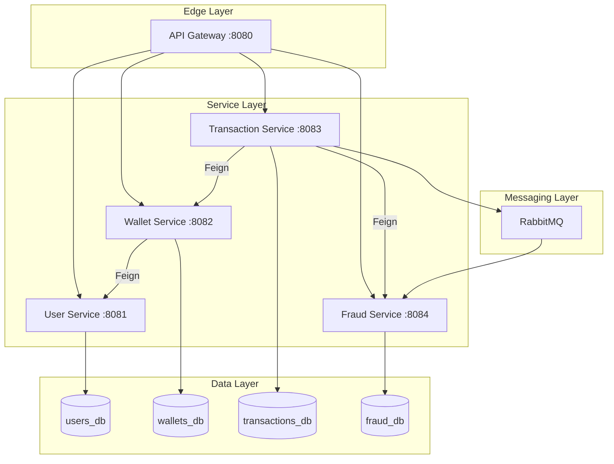

# Architecture Documentation

## System Overview

The Fintech Transaction & Wallet Platform is a microservices-based system designed for processing financial transactions with high reliability, security, and auditability.

## Architecture Style

**Microservices with API Gateway** — Each service owns its domain, database, and API surface. An API gateway routes traffic, propagates correlation IDs, and provides circuit breaking at the edge.

## Component Diagram

## Communication Patterns

| Pattern                 | Technology           | Use Case                              |
| ----------------------- | -------------------- | ------------------------------------- |
| Synchronous REST        | OpenFeign            | Service-to-service queries/commands   |
| Asynchronous Events     | RabbitMQ (AMQP)      | Post-transaction analysis, audit      |
| Circuit Breaker         | Resilience4j         | Fault isolation between services      |
| Retry with Backoff      | Resilience4j         | Transient failure recovery            |

## Data Architecture

Each service has its own PostgreSQL database (logical separation within a single PostgreSQL instance for development, separate instances in production).

### Consistency Model
- **Wallet balance**: Strong consistency via optimistic locking (`@Version`)
- **Cross-service**: Eventual consistency via domain events
- **Audit trail**: Append-only, immutable

## Security Architecture

1. **API Gateway** validates JWTs and propagates user identity
2. **Services** trust `X-User-Id` header from gateway
3. **Inter-service** calls authenticated via `X-Service-Auth` header
4. **Input validation** at every service boundary
5. **PII masking** in all log output
6. **SQL injection** prevented by parameterized queries (JPA)

## Key Design Decisions

See Architecture Decision Records (ADRs) in the `/docs/adr/` directory:
- [ADR-001: Microservices Architecture](adr/001-microservices-architecture.md)
- [ADR-002: Idempotency Strategy](adr/002-idempotency-strategy.md)
