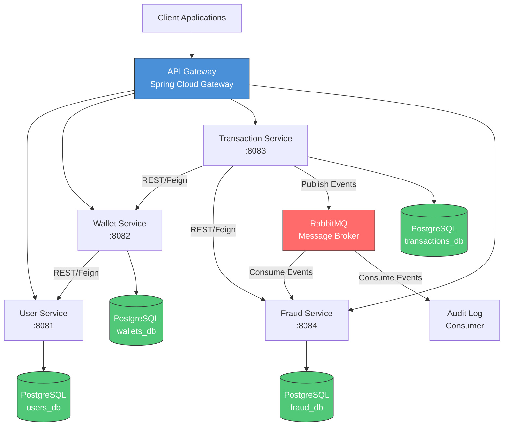

# SpecKit Plan — Fintech Transaction & Wallet Platform

> System architecture, service boundaries, data flow, and trade-off analysis.

---

## 1. System Architecture

### 1.1 High-Level Architecture (Mermaid)



### 1.2 ASCII Architecture Diagram

```
┌─────────────────────────────────────────────────────────────────┐
│                        CLIENT LAYER                             │
│              (Web App, Mobile App, Third-party)                 │
└──────────────────────────┬──────────────────────────────────────┘
                           │ HTTPS
┌──────────────────────────▼──────────────────────────────────────┐
│                     API GATEWAY (:8080)                         │
│         Spring Cloud Gateway + JWT Validation                   │
│         Rate Limiting + Request Routing                         │
└───┬──────────┬──────────────┬───────────────┬───────────────────┘
    │          │              │               │
    ▼          ▼              ▼               ▼
┌────────┐ ┌─────────┐ ┌────────────┐ ┌───────────┐
│ User   │ │ Wallet  │ │Transaction │ │  Fraud    │
│Service │ │ Service │ │  Service   │ │  Service  │
│ :8081  │ │  :8082  │ │   :8083    │ │   :8084   │
└───┬────┘ └──┬──────┘ └─────┬──────┘ └─────┬─────┘
    │         │    ▲          │   │           │
    │         │    │          │   └──►Feign───┘
    │         │    └──Feign───┘
    │         │               │
    ▼         ▼               ▼
┌────────┐ ┌─────────┐ ┌────────────┐ ┌───────────┐
│users_db│ │wallets  │ │transactions│ │ fraud_db  │
│        │ │  _db    │ │    _db     │ │           │
└────────┘ └─────────┘ └─────┬──────┘ └───────────┘
                              │
                    ┌─────────▼──────────┐
                    │     RabbitMQ       │
                    │  (Event Broker)    │
                    └─────────┬──────────┘
                              │
              ┌───────────────┼────────────────┐
              ▼               ▼                ▼
        ┌──────────┐  ┌────────────┐  ┌──────────────┐
        │  Fraud   │  │   Audit    │  │ Notification │
        │ Consumer │  │  Consumer  │  │  (Future)    │
        └──────────┘  └────────────┘  └──────────────┘
```

---

## 2. Service Boundaries

### 2.1 User Service

| Aspect           | Details                                              |
| ---------------- | ---------------------------------------------------- |
| **Responsibility** | User registration, profile management, KYC status  |
| **Owns**           | `users` table                                      |
| **Exposes**        | CRUD operations on user profiles                   |
| **Consumes**       | None                                               |
| **Events**         | `UserCreated`, `UserDeactivated`                   |

### 2.2 Wallet Service

| Aspect           | Details                                              |
| ---------------- | ---------------------------------------------------- |
| **Responsibility** | Wallet lifecycle, balance queries, balance mutations |
| **Owns**           | `wallets`, `wallet_audit_log` tables               |
| **Exposes**        | Create wallet, get balance, credit, debit          |
| **Consumes**       | User Service (validate user exists)                |
| **Events**         | `WalletCreated`, `BalanceUpdated`                  |

### 2.3 Transaction Service

| Aspect           | Details                                              |
| ---------------- | ---------------------------------------------------- |
| **Responsibility** | Transaction orchestration, idempotency, history    |
| **Owns**           | `transactions`, `idempotency_keys` tables          |
| **Exposes**        | Process payment, get transaction history           |
| **Consumes**       | Wallet Service (credit/debit), Fraud Service       |
| **Events**         | `TransactionCreated`, `TransactionCompleted`, `TransactionFailed` |

### 2.4 Fraud Service

| Aspect           | Details                                              |
| ---------------- | ---------------------------------------------------- |
| **Responsibility** | Rule-based fraud detection, risk scoring           |
| **Owns**           | `fraud_checks`, `fraud_rules` tables               |
| **Exposes**        | Evaluate transaction risk                          |
| **Consumes**       | Transaction events (async)                         |
| **Events**         | `FraudAlertRaised`                                 |

---

## 3. Data Flow

### 3.1 Transaction Processing Flow

```
Client → API Gateway → Transaction Service
                            │
                            ├─1→ Check idempotency key (local DB)
                            │     ├─ Key exists → Return cached response
                            │     └─ Key new → Continue
                            │
                            ├─2→ Fraud Service (sync REST call)
                            │     ├─ APPROVED → Continue
                            │     ├─ REVIEW → Continue with flag
                            │     └─ REJECTED → Return 422
                            │
                            ├─3→ Wallet Service (sync REST call)
                            │     ├─ Debit source wallet
                            │     └─ Credit target wallet
                            │
                            ├─4→ Store transaction record (local DB)
                            │
                            ├─5→ Store idempotency key + response (local DB)
                            │
                            └─6→ Publish TransactionCompleted event (RabbitMQ)
                                    │
                                    ├──→ Fraud Service (async analysis)
                                    └──→ Audit Consumer (async logging)
```

### 3.2 Wallet Balance Update Flow

```
Transaction Service → Wallet Service
                          │
                          ├─1→ Load wallet with optimistic lock (version check)
                          ├─2→ Validate sufficient balance (for debit)
                          ├─3→ Update balance + increment version
                          ├─4→ Insert audit log entry
                          └─5→ Return updated wallet
                                │
                          (On OptimisticLockException → Retry up to 3 times)
```

---

## 4. Trade-Off Analysis

### 4.1 Eventual Consistency vs. Strong Consistency

| Decision                        | Choice               | Rationale                                                     |
| ------------------------------- | -------------------- | ------------------------------------------------------------- |
| Wallet balance updates          | **Strong consistency** | Financial accuracy is non-negotiable. Optimistic locking + retry. |
| Cross-service transaction state | **Eventual consistency** | Saga pattern with compensating transactions. Latency trade-off acceptable. |
| Fraud detection feedback        | **Eventual consistency** | Async analysis is acceptable; sync check is best-effort.      |
| Audit logging                   | **Eventual consistency** | Fire-and-forget via message queue. Non-blocking to main flow. |

### 4.2 Monorepo vs. Polyrepo

| Approach   | Choice       | Rationale                                                    |
| ---------- | ------------ | ------------------------------------------------------------ |
| Repository | **Monorepo** | Simpler dependency management, atomic commits across services, easier local development. Trade-off: tighter coupling in CI/CD. |

### 4.3 Synchronous vs. Asynchronous Communication

| Communication Path               | Pattern    | Rationale                                           |
| -------------------------------- | ---------- | --------------------------------------------------- |
| Transaction → Wallet             | **Sync**   | Balance update must complete before confirming txn.  |
| Transaction → Fraud (pre-check)  | **Sync**   | Must block if fraud risk is HIGH before proceeding.  |
| Transaction → Fraud (analysis)   | **Async**  | Post-transaction analysis is non-blocking.           |
| Transaction → Audit              | **Async**  | Audit logging must not impact transaction latency.   |

### 4.4 Database per Service vs. Shared Database

| Approach  | Choice                   | Rationale                                              |
| --------- | ------------------------ | ------------------------------------------------------ |
| Database  | **Database per service** | Strong ownership, independent scaling, no shared locks. Trade-off: cross-service queries require API calls. |

---

## 5. Non-Functional Requirements

| Requirement      | Target                                      |
| ---------------- | ------------------------------------------- |
| Availability     | 99.9% uptime                                |
| Latency (P95)    | < 200ms for transaction processing          |
| Throughput       | 1,000 transactions/second per instance      |
| Data Retention   | Transaction data: 7 years, Audit logs: 10 years |
| Recovery (RTO)   | < 15 minutes                                |
| Recovery (RPO)   | < 1 minute (synchronous replication)        |

---

## 6. Deployment Topology (AWS-Aligned)

```
┌─────────────────────────────────────────────────┐
│                   AWS Region                     │
│                                                  │
│  ┌─────────────┐     ┌───────────────────────┐  │
│  │   Route 53  │────▶│    ALB (API Gateway)  │  │
│  └─────────────┘     └───────────┬───────────┘  │
│                                  │               │
│  ┌───────────────────────────────▼────────────┐  │
│  │              ECS Fargate Cluster           │  │
│  │  ┌────────┐ ┌────────┐ ┌────────┐ ┌────┐  │  │
│  │  │User Svc│ │Wallet  │ │Txn Svc │ │Fraud│  │  │
│  │  │(x2)    │ │Svc(x3) │ │(x3)    │ │(x2) │  │  │
│  │  └────────┘ └────────┘ └────────┘ └────┘  │  │
│  └────────────────────────────────────────────┘  │
│                                                  │
│  ┌──────────────┐   ┌──────────────────────┐    │
│  │ Amazon RDS   │   │   Amazon MQ          │    │
│  │ PostgreSQL   │   │   (RabbitMQ)         │    │
│  │ Multi-AZ     │   │                      │    │
│  └──────────────┘   └──────────────────────┘    │
│                                                  │
│  ┌──────────────┐   ┌──────────────────────┐    │
│  │ CloudWatch   │   │   AWS Secrets Mgr    │    │
│  │ (Monitoring) │   │   (Config/Secrets)   │    │
│  └──────────────┘   └──────────────────────┘    │
└─────────────────────────────────────────────────┘
```

---

*This plan serves as the architectural blueprint. All implementation decisions must trace back to this document.*
